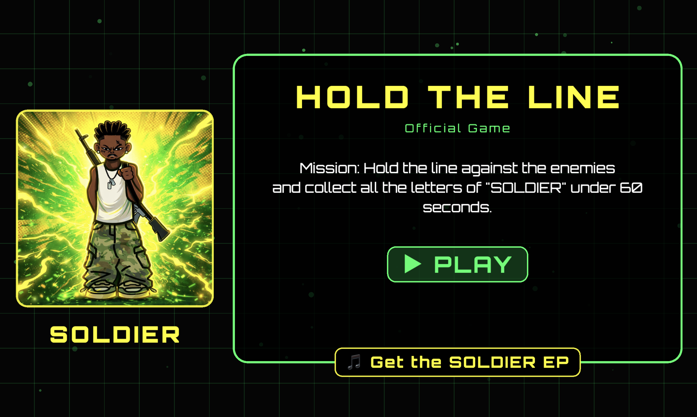

# Hold the Line

A promotional game for **Manfred's** music album launch: **"Soldier"**

A fast-paced action game where you play as a soldier defending against waves of negative emotions. Collect letters to spell "SOLDIER" while fending off enemies representing Fear, Anxiety, Anger, Despair, and Guilt.

## How to Play

- **Move**: Use arrow keys or touch controls to move your soldier
- **Shoot**: Use space bar or touch controls to fire projectiles at enemies
- **Collect Letters**: Gather letters that spell "SOLDIER" to progress
- **Survive**: Defend against waves of emotional enemies and achieve the highest score

## Features

- 🎮 Intuitive touch and keyboard controls
- 🎯 Challenging wave-based gameplay
- 🏆 Global leaderboard system
- 🎵 Immersive sound effects and music
- 📱 Responsive design for mobile and desktop

## Play Now

Simply open `index.html` in your web browser to start playing!

---

### Sound Effects Attribution

Sound Effects:

male-death-sound.wav: [Hiran Vinodya](https://pixabay.com/users/vinodadora-30315691/?utm_source=link-attribution&utm_medium=referral&utm_campaign=music&utm_content=128357) from [Pixabay](https://pixabay.com//?utm_source=link-attribution&utm_medium=referral&utm_campaign=music&utm_content=128357)

countdown-from-10.wav: [Otto](https://pixabay.com/users/voicebosch-30143949/?utm_source=link-attribution&utm_medium=referral&utm_campaign=music&utm_content=190389) from [Pixabay](https://pixabay.com/sound-effects//?utm_source=link-attribution&utm_medium=referral&utm_campaign=music&utm_content=190389)

congratulations.wav: [Otto](https://pixabay.com/users/voicebosch-30143949/?utm_source=link-attribution&utm_medium=referral&utm_campaign=music&utm_content=172193) from [Pixabay](https://pixabay.com/sound-effects//?utm_source=link-attribution&utm_medium=referral&utm_campaign=music&utm_content=172193)

Others: [Mixkit](https://mixkit.co/), [Quick Sounds](https://quicksounds.com/)
